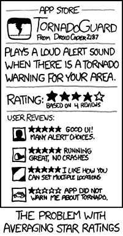

# Documenting Business Rules

----
# Learning Objectives
- Understand the role of business rules in software systems
- Apply UML activity diagrams to document business rules.

---- 
# Definition
> “A business rule is a statement that defines or constrains some aspect of the business. It is intended to assert business structure or to control or influence the behavior of the business.”
* Facts ('no GST on food')
* Constraints ('only 30 books checked out')
* Inferences ('if X holds, Y also holds')
* Computations ('all sales over 50$ pay shipping of 10% of the total')
* Action Enablers ('if X holds, then do Y')

----
# Vs. Business Requirements and Goals
* Business Goals are objectives the business wants to achieve with the software system.
* Business Processes are the activities involved in carrying out business activities, that may be influenced by business rules.
* Often both of these are not well documented, even as they are vital to the company. 

----
# Examples
- name an example of a business rule for BC Ferries.

<!-- 1. passengers may not remain on the car deck. 2. passenger ticket sales end 10 mins before sailing. 3. reservation fees are 15$ on top of ticket and non-refundable-->

----

----
# Writing Business Rules
* Keep them atomic (no disjunctions or conjunctions (table 9.3))
* Store business rules in a catalog. 
* Uncover them:
  * Sometimes they appeared as stored procedures in a db.
  * Reverse engineer from logic in the software.
  * Government regulation.
  * Business process modeling.

----
# Activity Diagrams
A visual representation of a business process or rule.
See Fig 8-4.

----
# Exercise
Draw an activity diagram on the whiteboard representing your team's app.