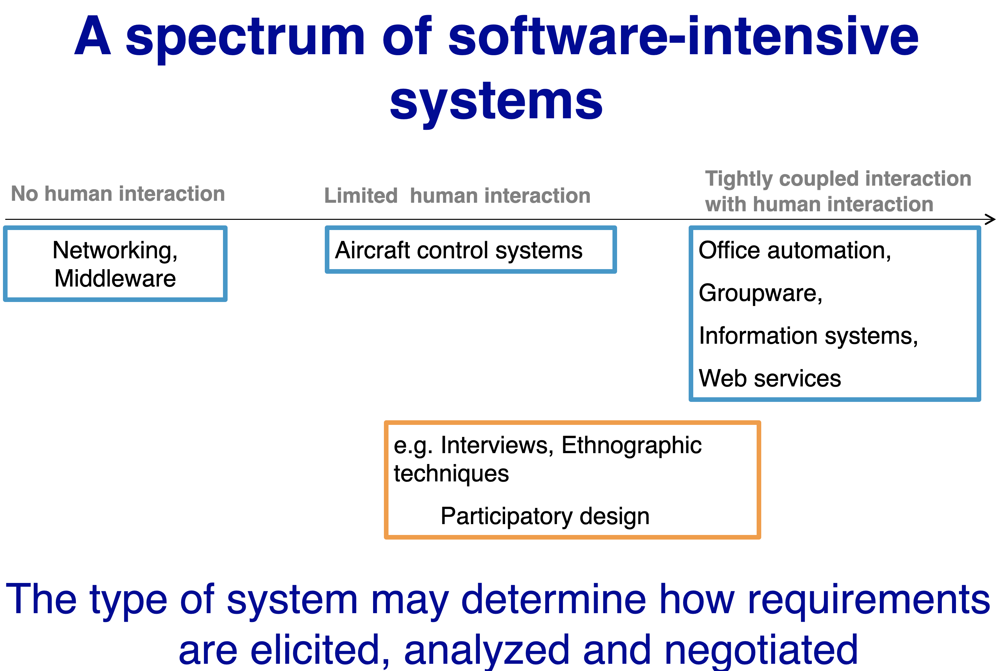

# Outline

- Introduce RE activities
- Introduce the RE process within the larger SE process
- Types of software systems and RE techniques 
- Types of customer-supplier relationships and RE processes

----
# Requirements Engineering 

- Software quality as fitness for purpose
- The case of software-intensive systems
  - Hardware, software and human activities
- **Requirements Engineering**: set of activities to identify purpose in the context of human activities

----
# Requirements Engineering

- Complexity of purpose
  - human-computer interaction: intricate and complex

- Design of software intensive systems: type of a wicked problem:
  - no single formulation of the problem
  - Continuous need for exploration
  - No right or wrong solution
  - Unique characteristics	

- Identifying the problem is a problem in itself

----
# Hard vs. soft systems

- Soft systems methods suited for wicked problems
- Soft Systems methods adopt a Human-centered design view where:
  - RE = continuing negotiation process  between multiple perspectives
- The design of software is inseparable from the  task of defining the human activities  supported by that software 
  
----
# Requirements Engineering (def)
> Requirements Engineering (RE) is a set of activities concerned with identifying and communicating the purpose of a software intensive system, and the contexts in which it will be used. Hence, RE acts as the bridge between the real-world needs of users, customers, and other constituencies affected by a software system, and the capabilities and opportunities afforded by software-intensive technologies.

[Easterbrook, Chapter 1]

----
# A spectrum of software-intensive systems
 

- - -
# Requirements describe problems

- Requirements describe the problem statement 
- and activities to be supported by the system
- Ideal: separate the problem from solutions
- Practice: very difficult to accomplish

----
# Requirements Engineering: the tension between describing the problem vs. solution 

----
# Requirements Specification: Bridging two different worlds

----
# The Requirements “Problem”

Build a Machine, S, such that alongside world Knowledge K, Requirements R, are entailed 

$K, S ⊢ R$

<!-- Revision: Find Plans P that non-monotonically entail the Goals, Qualities, and Preferences A that were elicited -->
<!-- $P,K ⊢ G, Q, A$ -->

----
# Elements of the Requirements Problem

- Goals and requirements: desires of the stakeholders
  - Qualities: desired quality constraints
- Specifications: tasks that stakeholders and software will carry out
- World knowledge and domain assumptions K: assertions and declarations about the world.

----
# Example - problem and req vs. solution statement

- Context: Design a secure means (software, i.e the machine) to store data
- Example of a requirements (for the machine): “prevent access to unauthorized personnel”
- Example of Domain property: “only a manager can assign access authority”
- Specification for the machine:  “when the user enters a valid password, the computer will unlock the door” (or “the system requires a login and password for access”)

----
# RE processes (revisited)

- Typically involves activities of:
- Elicitation
- Analysis
- Specification
- Validation and verification
- Negotiation
- Management

----
# References

1. Thayer, R.H. and Dorfman, M.: Software Requirements Engineering, IEEE Computer Society Press, 2000
2. Macaulay, L.A.: Requirements Engineering, Springer, 1996

